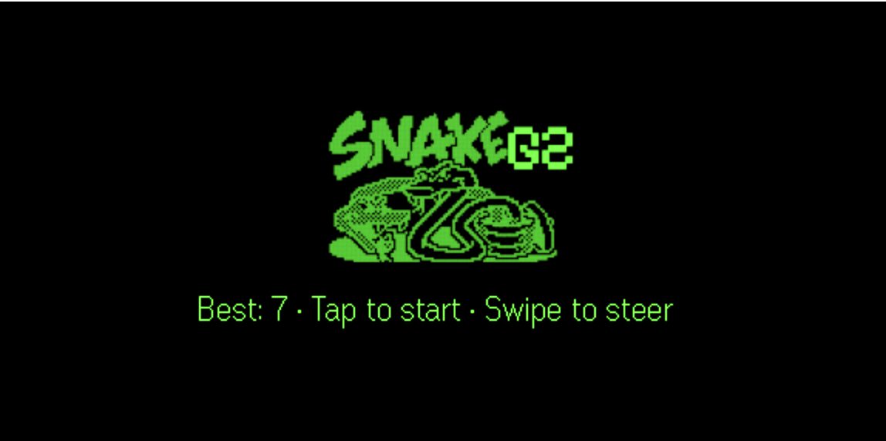
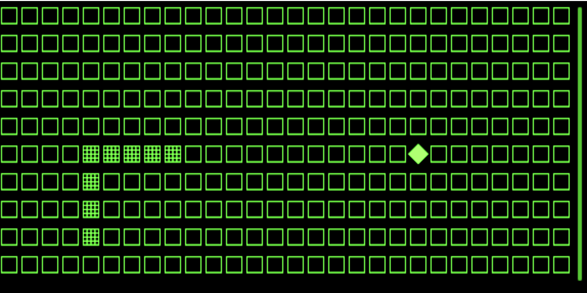
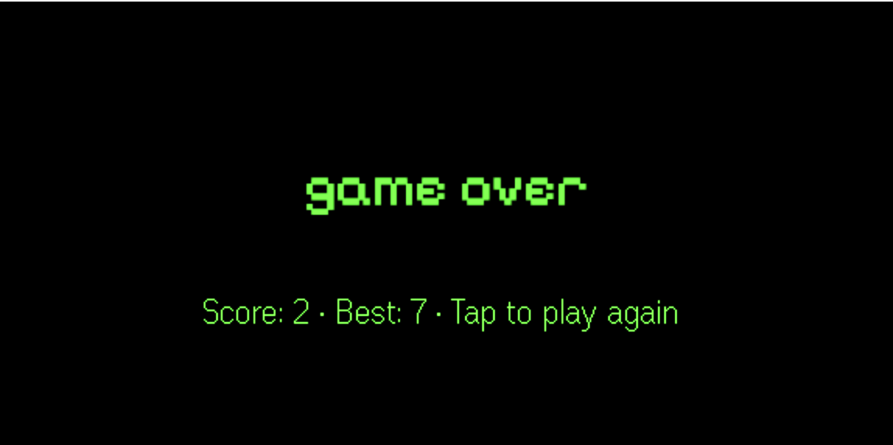

# Snake for Even G2

> See also: [G2 development notes](https://github.com/nickustinov/even-g2-notes/blob/main/G2.md) – hardware specs, UI system, input handling and practical patterns for Even Realities G2.

Classic Snake game for [Even Realities G2](https://www.evenrealities.com/) smart glasses.

Swipe to steer, eat food, grow longer. No server required – everything runs client-side.

<p>
  
  
</p>
<p>
  
</p>

## Architecture

The game uses three different page layouts, switching between them via `rebuildPageContainer`:

- **Splash screen** – image container with logo + text container with instructions
- **Gameplay** – text container with unicode grid (`□` empty, `▦` snake, `◆` food)
- **Game over** – image container with game over graphic + text container with score

A hidden text container with `isEventCapture: 1` and minimal content (`' '`) is present on every page. This receives scroll/tap events without the firmware's internal text scrolling consuming swipe gestures.

During gameplay, only `textContainerUpgrade` is called – no page rebuilds until the game ends.

```
tick() → pushFrame() → sleep(remaining) → repeat
```

The loop awaits each text push before scheduling the next tick. If a push is still in flight, the frame is silently dropped.

### Grid

- 28 columns × 10 rows
- Wall death (hitting edges ends the game)
- ~350ms per tick (~3 moves/second)

## Controls

| Input | Action |
|---|---|
| Tap | Start game / restart after game over |
| Swipe down | Turn right (clockwise) |
| Swipe up | Turn left (counterclockwise) |
| Double tap | Start game / restart after game over |

## Project structure

```
g2/
  index.ts       App module registration
  main.ts        Bridge connection and auto-connect
  app.ts         Game loop orchestrator
  state.ts       Game state (snake, food, direction, score)
  game.ts        Game logic (tick, collision, turning)
  renderer.ts    Text/image rendering, page layouts, frame push
  events.ts      Event normalisation + input dispatch
  layout.ts      Display and grid constants
  logo.png       Splash screen logo (200×100)
  gameover.png   Game over graphic (200×100)
```

## Setup

```bash
npm install
npm run dev
```

### Run with even-dev simulator

```bash
cd /path/to/even-dev
APP_PATH=/path/to/snake-even-g2 ./start-even.sh
```

### Run on real glasses

Generate a QR code and scan it with the Even App:

```bash
npm run dev   # keep running
npm run qr    # generates QR code for http://<your-ip>:5173
```

### Package for distribution

```bash
npm run pack  # builds and creates snake.ehpk
```

## Tech stack

- **G2 frontend:** TypeScript + [Even Hub SDK](https://www.npmjs.com/package/@evenrealities/even_hub_sdk)
- **Build:** [Vite](https://vitejs.dev/)
- **CLI:** [evenhub-cli](https://www.npmjs.com/package/@evenrealities/evenhub-cli)
